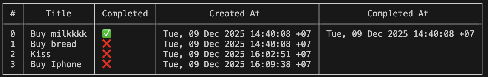

# 📘 Todo List CLI — Go Version

A simple command-line Todo List application written in Go.  
Supports adding, listing, editing, deleting, and toggling todos with JSON file storage.



---

## 🚀 Getting Started

Run the application:

```bash
go run . [flags]
```

## 🧭 Available Commands

### 1. List all todos

```bash
go run . -list
```

### 2. Add a new todo

```bash
go run . -add "Buy Iphone"
```

### 3. Edit a todo

```bash
# Editing todo with index = 3
go run . -edit "3:Buy Iphone 16 Pro Max"
```

### 4. Delete a todo

```bash
go run . -del 2
```
